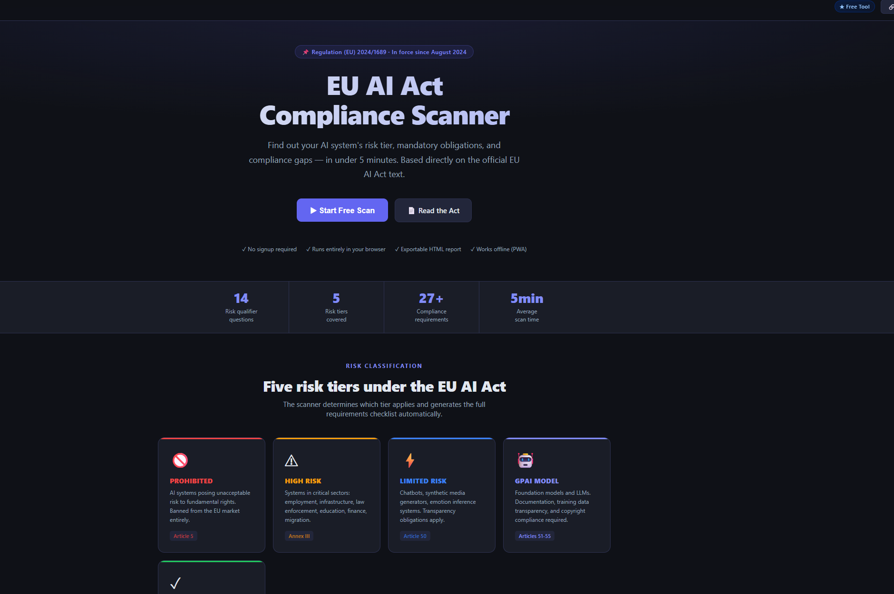
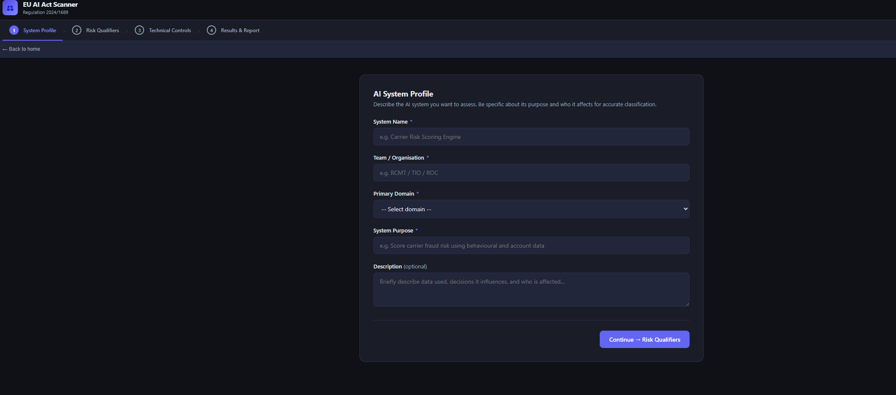
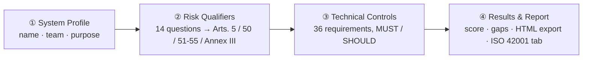
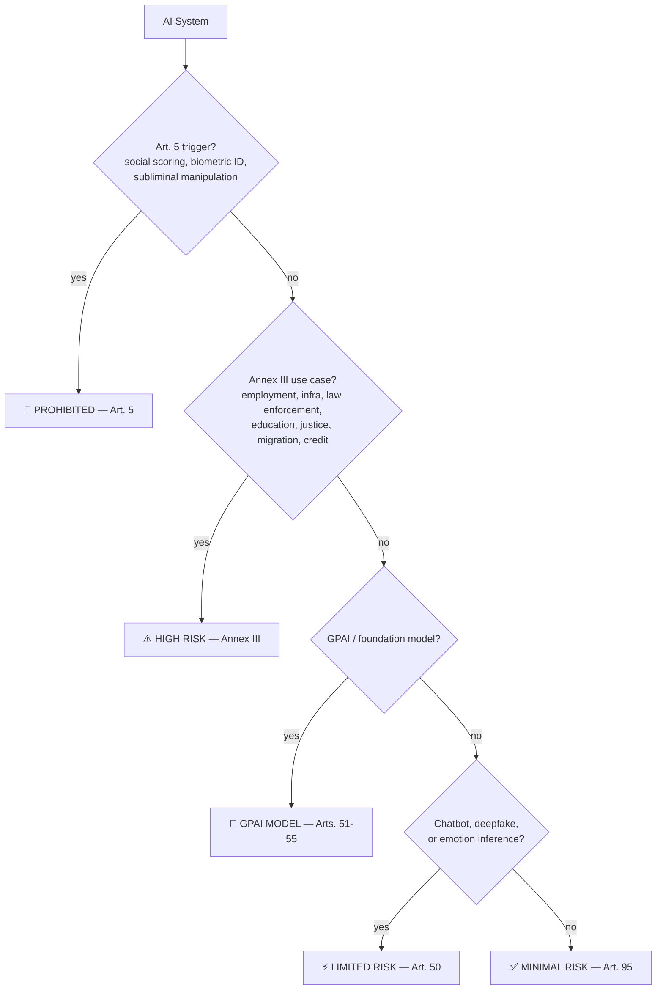

# EU AI Act Compliance Scanner

**Classify any AI system against Regulation (EU) 2024/1689 in under 10 minutes.**
No signup. No server. No data ever leaves your browser.

---

## Preview

    
  

## The problem

The EU AI Act (Regulation 2024/1689) is 144 pages long, has a five-tier risk system, and applies phased deadlines through 2027. Most teams building or buying an AI system have no fast way to answer: *"which tier are we in, and what do we actually have to do about it?"*

This tool answers that in four steps, in the browser, with every answer traced back to a specific article.

## How it works

## How to use it

1. **Open the app** — click Start Free Scan on the [live site](https://jeevan-0508.github.io/eu-ai-act-scanner), or open the downloaded file directly. No account, no install required.
2. **Fill in the System Profile** — name your AI system, the team that owns it, its primary domain, and a one-line purpose. This is just for the report header, not classification.
3. **Answer the 14 Risk Qualifier questions** — each maps to a specific article (Art. 5, Annex III, Art. 50, Arts. 51-55). Unsure why a question matters? Click "Explain why" under it for a plain-English breakdown with real-world examples.
4. **Check off Technical Controls** — the app already narrowed the checklist to only the requirements that apply to your tier. Tick whatever you already have in place; anything left unchecked becomes a gap.
5. **Read your Results** — risk tier, compliance score, mandatory-requirement score, and a prioritized action list (critical gaps first). High-Risk and GPAI tiers also get ISO/IEC 42001 and NIST AI RMF crosswalk tabs.
6. **Export the report** — one click downloads a self-contained HTML compliance report you can attach to an email, ticket, or audit file.
7. **(Optional) Install it as an app** — it's a PWA, so it can run offline once installed (see links below).

## Get the app

| 🌐 Live App | 💾 Download | 🖥️ Install (Desktop) | 📱 Install (Mobile) |
|:---:|:---:|:---:|:---:|
| [**OPEN IN BROWSER**](https://jeevan-0508.github.io/eu-ai-act-scanner) | [**DOWNLOAD index.html**](https://github.com/Jeevan-0508/eu-ai-act-scanner/raw/main/index.html) | Chrome/Edge → install icon (⊕) in the address bar on the live site | Safari/Chrome → Share/Menu → **Add to Home Screen** |
| Runs instantly, always latest version | Single self-contained file — double-click to run fully offline, no server needed | Runs in its own window, works offline after first load | Full-screen app icon, works offline after first load |

## Classification logic

## Features

| | |
|---|---|
| **14 risk-qualifier questions** | Each mapped to a specific article, with an "explain why" panel in plain English + Amazon/logistics-style examples |
| **36 compliance requirements** | Across all 5 tiers, tagged **MUST** (legally mandatory) or **SHOULD** (best practice) |
| **Compliance Timeline** | Real phased rollout Aug 2024 → Aug 2027, flags deadlines already passed |
| **ISO/IEC 42001:2023 crosswalk** | 13 management-system clauses mapped to AI Act articles, scored separately (High-Risk / GPAI tiers) |
| **NIST AI RMF 1.0 crosswalk** | 14 subcategories across GOVERN / MAP / MEASURE / MANAGE, mapped to AI Act articles, scored separately (High-Risk / GPAI tiers) |
| **Exportable HTML report** | Generated entirely client-side, no server round-trip |
| **PWA** | Installable, works offline, network-first service worker so updates are never stuck behind a stale cache |
| **Regulation-currency tracking** | "Last verified" badge + one-click check against the live EUR-Lex text — see [CHANGELOG.md](CHANGELOG.md) |

## Tech stack

Single `index.html`. Vanilla JS, zero dependencies, zero build step. `manifest.json` + `sw.js` for PWA install.

## Regulatory basis

> **Regulation (EU) 2024/1689** of the European Parliament and of the Council of 13 June 2024 laying down harmonised rules on artificial intelligence (Artificial Intelligence Act). Official Journal of the European Union, L 2024/1689, 12 July 2024.

Full text: [eur-lex.europa.eu](https://eur-lex.europa.eu/legal-content/EN/TXT/?uri=OJ:L_202401689)

This is a static tool — its compliance data does not update itself. See [CHANGELOG.md](CHANGELOG.md) for how currency is tracked.

**Disclaimer:** For internal compliance self-assessment only. Not legal advice.

## License

All rights reserved — see [LICENSE](LICENSE). No permission is granted to copy, modify, redistribute, or reuse this code without written permission from the author.

---

Built by **[Jeevan Kumar](https://github.com/Jeevan-0508)** — Amazon Transportation Risk & Fraud Operations, transitioning into AI Governance / AI Risk.

