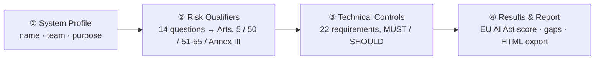
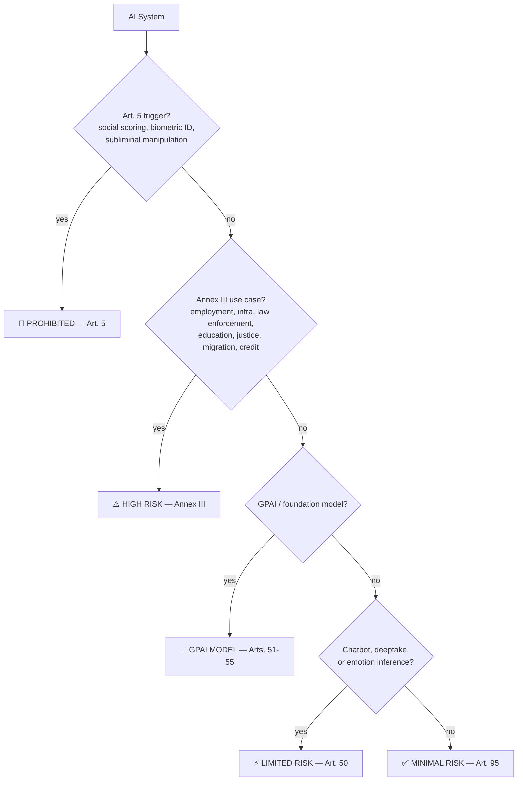

# AI Compliance Scanner

**EU AI Act &middot; ISO/IEC 42001 &middot; NIST AI RMF — three frameworks, each with its own independent score, in under 10 minutes each.**
No signup. No server. No data ever leaves your browser.

---

## Preview

    
  

## The problem

AI governance now spans multiple frameworks: the EU AI Act (legally binding, phased deadlines through 2027), ISO/IEC 42001 (the international AI management-system standard), and the NIST AI RMF (the US voluntary risk framework). Most teams have no fast way to check where they stand against any of them, let alone all three.

This tool gives each framework its own scanner and its own independent score — pick the one you need from the home page or the top nav.

## How it works

Four top-level pages, one nav bar:

- **Home** — pick a scanner, or read about the EU AI Act's five risk tiers.
- **EU AI Act Scanner** — the full 4-step wizard: System Profile → Risk Qualifiers → Technical Controls → Results & Report.
- **ISO/IEC 42001 Scanner** — a standalone checklist against the 13 core clauses of the AI management-system standard. Its own coverage score, independent of the EU AI Act result.
- **NIST AI RMF Scanner** — a standalone checklist across GOVERN / MAP / MEASURE / MANAGE. Its own coverage score, independent of the other two.

## How to use it

1. **Open the app** — go to the [live site](https://jeevan-0508.github.io/eu-ai-act-scanner) and pick a scanner from Home or the top nav. No account, no install required.
2. **EU AI Act path** — fill in the System Profile, answer the 14 Risk Qualifier questions (each maps to a specific article — click "Explain why" for a plain-English breakdown), check off the Technical Controls that already apply to your tier, then read your Results: risk tier, compliance score, mandatory-requirement score, and a prioritized action list.
3. **ISO/IEC 42001 or NIST AI RMF path** — go straight to that tab, check off what you already have in place, and get a coverage score for that framework alone — no wizard, no dependency on your EU AI Act classification.
4. **Export the report** — from the EU AI Act Results page, one click downloads a self-contained HTML compliance report you can attach to an email, ticket, or audit file.
5. **(Optional) Install it as an app** — it's a PWA, so it can run offline once installed (see links below).

## Get the app

| 🌐 Live App | 💾 Download | 🖥️ Install (Desktop) | 📱 Install (Mobile) |
|:---:|:---:|:---:|:---:|
| [**OPEN IN BROWSER**](https://jeevan-0508.github.io/eu-ai-act-scanner) | [**DOWNLOAD index.html**](https://github.com/Jeevan-0508/eu-ai-act-scanner/raw/main/index.html) | Chrome/Edge → install icon (⊕) in the address bar on the live site | Safari/Chrome → Share/Menu → **Add to Home Screen** |
| Runs instantly, always latest version | Single self-contained file — double-click to run fully offline, no server needed | Runs in its own window, works offline after first load | Full-screen app icon, works offline after first load |

## Classification logic

## Features

| | |
|---|---|
| **EU AI Act scanner** | 14 risk-qualifier questions (each mapped to a specific article, with an "explain why" panel) → 22 requirements across 5 tiers, tagged **MUST**/**SHOULD** → compliance score + prioritized gap list |
| **ISO/IEC 42001 scanner** | Standalone checklist, 13 management-system clauses, its own coverage score — independent of EU AI Act tier |
| **NIST AI RMF scanner** | Standalone checklist, 15 subcategories across GOVERN / MAP / MEASURE / MANAGE, its own coverage score — independent of the other two |
| **Compliance Timeline** | Real phased EU AI Act rollout Aug 2024 → Aug 2027, flags deadlines already passed |
| **Exportable HTML report** | Generated entirely client-side, no server round-trip |
| **PWA** | Installable, works offline, network-first service worker so updates are never stuck behind a stale cache |
| **Regulation-currency tracking** | "Last verified" badge + one-click check against the live EUR-Lex text — see [CHANGELOG.md](CHANGELOG.md) |

## Tech stack

Single `index.html`. Vanilla JS, zero dependencies, zero build step. `manifest.json` + `sw.js` for PWA install.

## Regulatory basis

> **Regulation (EU) 2024/1689** of the European Parliament and of the Council of 13 June 2024 laying down harmonised rules on artificial intelligence (Artificial Intelligence Act). Official Journal of the European Union, L 2024/1689, 12 July 2024.

Full text: [eur-lex.europa.eu](https://eur-lex.europa.eu/legal-content/EN/TXT/?uri=OJ:L_202401689)

This is a static tool — its compliance data does not update itself. See [CHANGELOG.md](CHANGELOG.md) for how currency is tracked.

**Disclaimer:** For internal compliance self-assessment only. Not legal advice.

## License

All rights reserved — see [LICENSE](LICENSE). No permission is granted to copy, modify, redistribute, or reuse this code without written permission from the author.

---

Built by **[Jeevan Siddhabhaktula](https://github.com/Jeevan-0508)** — Amazon Transportation Risk & Fraud Operations, transitioning into AI Governance / AI Risk.

